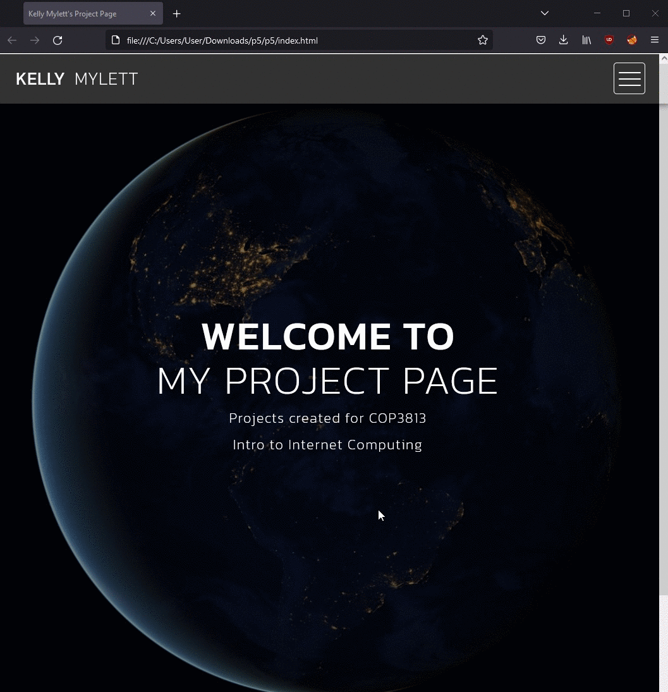
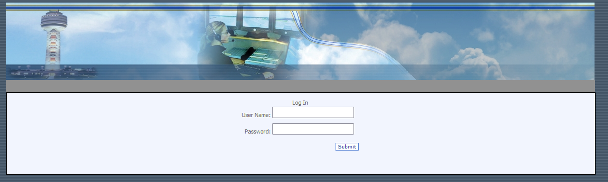
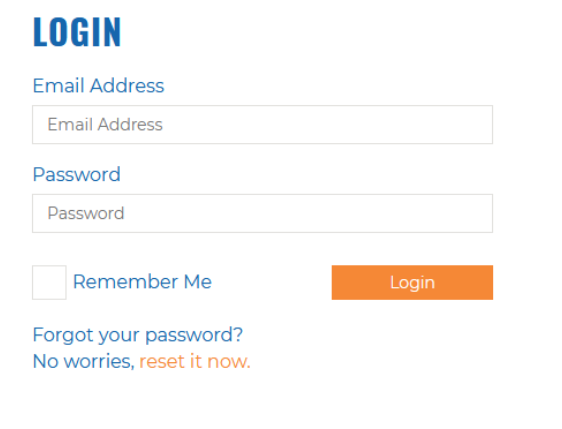
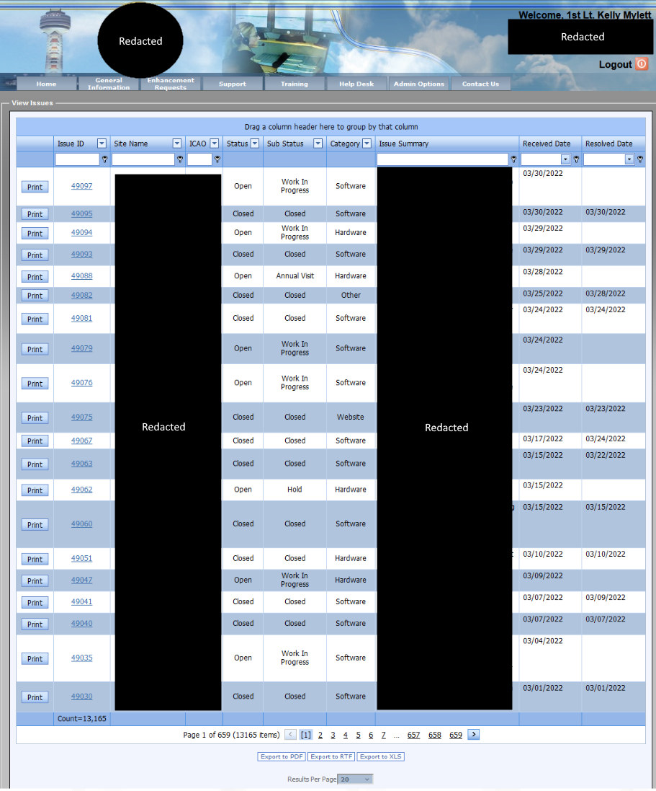
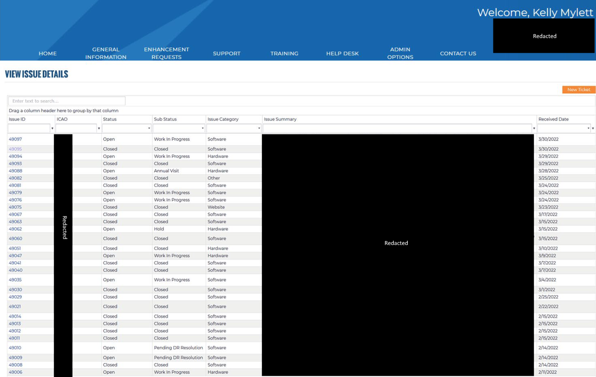
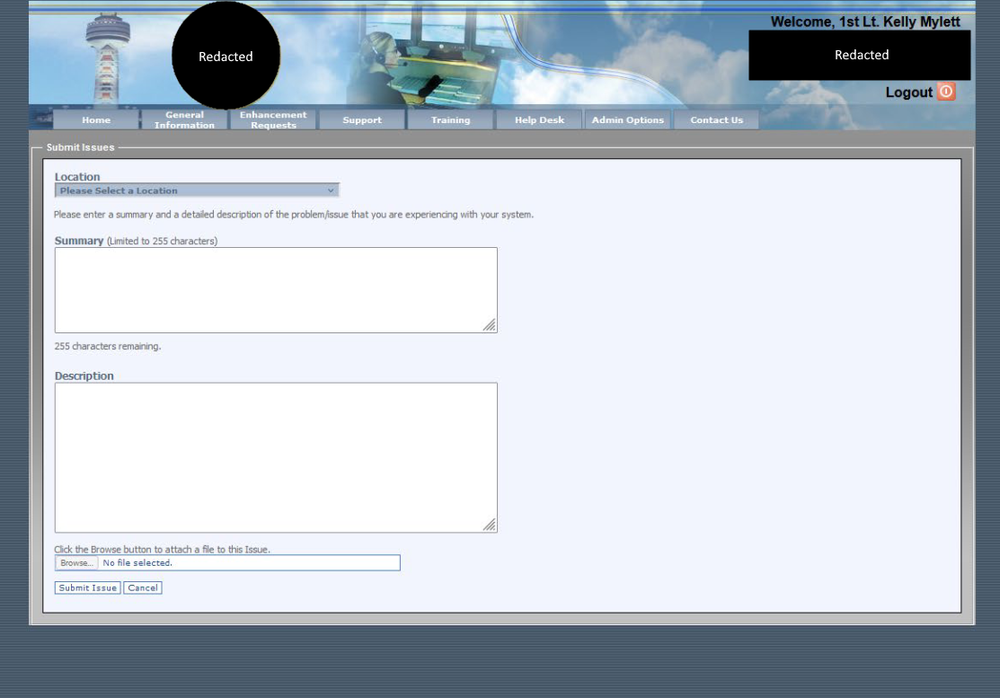
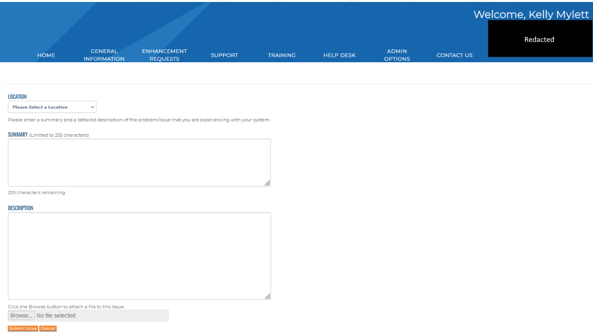
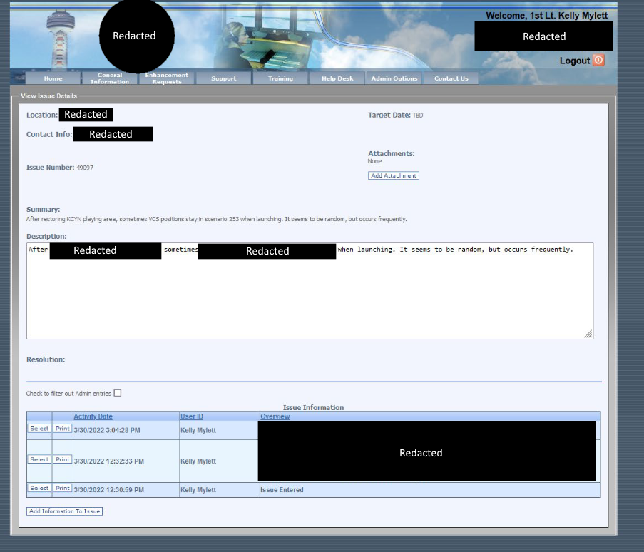
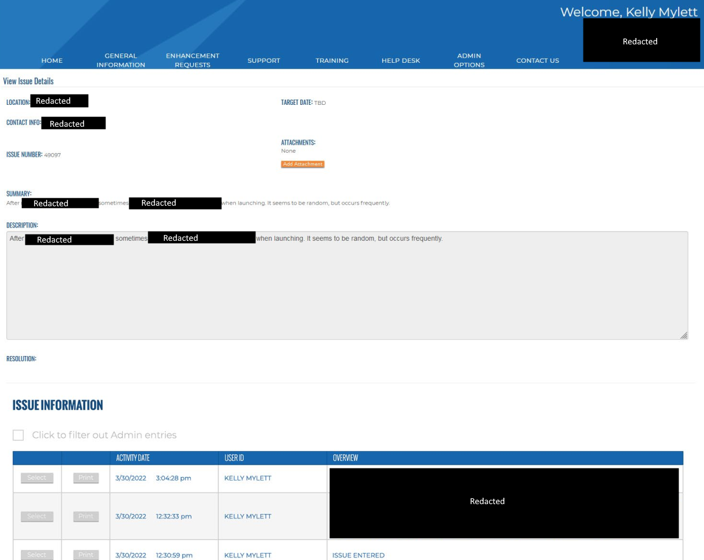

# webdev
Examples of some of my web design projects

Projects:

Simple pages created for Internet Computing:

Fullstack Web Portal created for Principals of Software Engineering:
[Click here for a video demo](https://www.youtube.com/watch?v=oUu_haCwMXc)

Work Project: Refreshing a company's aging helpdesk page without any backend code refactoring.
OLD  

NEW  

OLD  

NEW  

OLD  

NEW  

OLD  

NEW  

